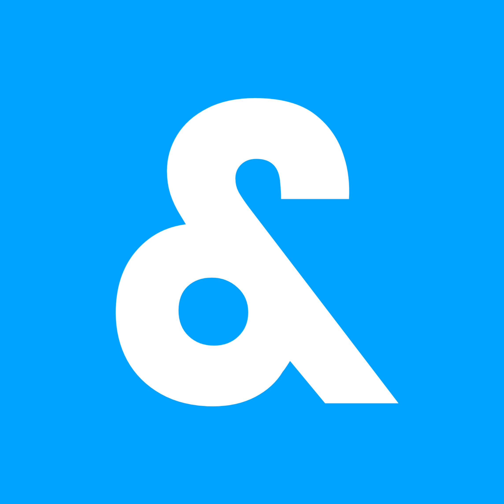

  <h1 align="center">Howdy, I'm Agez</h1>

I am a Multiplatform Application Development (DAM) student in Mallorca, currently learning Java, MySQL, HTML, CSS, and XML. I am passionate about computing and programming, always exploring new technologies.

🎮 Game Development
As a hobby, I develop video games using Unity and Sbox.

In Unity, I work in a team creating games just for fun, without official releases.
In Sbox, I have been exploring this new engine since 2023, testing its graphics engine and pushing its limits.
🎨 Editing & Modeling
I also enjoy photo and video editing, using tools like Photoshop and Premiere Pro. Additionally, I experiment with Blender for 3D modeling and animation.

🚀 Always looking for new challenges and learning opportunities in the world of development. Let's code!

<h3 align="left">Programming Language:</h3>

   

<h3 align="left">Game Engine:</h3>

<h3 align="left">Other Softwares:</h3>

 

   

<h2 align="left">Hi 👋! My name is ... and I'm a ..., from ....</h2>

###

  
  <!--  -->

###

###

  
  
  
  
  
  
  
  
  
  
  
  
  

###

  
  
  
  
  
  

###

 

###
