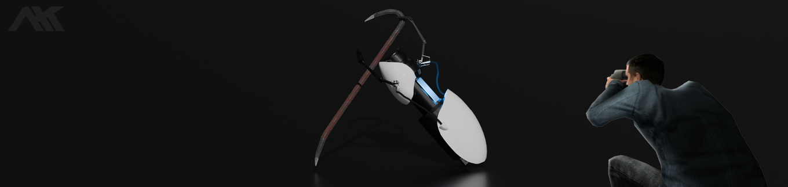

<h3 align="center">"/></h3>

<h1 align="center"> &lt;About Me&gt; </h1>

 I'm #####, an amateur graphic designer and beginner programmer. I am currently learning C# for game development while taking a Java course. Previously, I worked as a freelance graphic designer, but I like the idea of programming to create games, to show and express my creativity. 

 

### What I'm doing right now

🎮 Currently exploring game development with <b>Unity</b> & <b>Sbox</b> 
👨‍🎓 Studying Multiplatform Application Development (DAM) in <b>Balearic Islands</b> 
💻 Learning <b>Java</b>, <b>C#</b>, <b>MySQL</b>, <b>HTML</b>, <b>CSS</b>, and <b>XML</b> 
 🖥️ Experimenting with 3D modeling in <b>Blender</b>

<h1 align="left">Languages</h1>

<h1 align="left">🧰 Softwares</h1>

   

<h2 align="center">Stats</h2>

  
  <!--  -->

